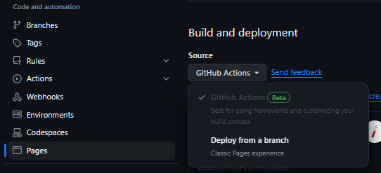
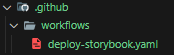
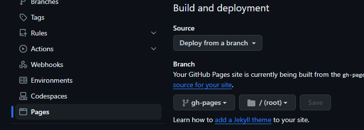

# Projeto em produção:

- **https://jeimissonb.github.io/alfabit-design-system/**

# Figma do projeto:

- **https://www.figma.com/file/h86gUvqUXTKwgr6tVYinLT/React%3A-Design-System-com-Tailwind?type=design&node-id=143%3A9138&mode=design&t=SJFgJbpSYGC8SjmA-1**

# Storybook Deploy With CI, by GitHub Actions

## Passos para dar deploy de storybook com CI, bem como de outras aplicações React.

> Os comandos a seguir funcionaram para deploy com integração contínua **_CI_** (onde o próprio Github actions faz todo o processo de build e deploy de forma automatizada com base nas alterações "**_on push_**" da branch configurada no arquivo .yaml) de storybook 7.6.15 com VITE 5.1.0, em um projeto React 18.2.0 com Typescript 5.2.2.

- Antes de realizar as configurações, é necessário estar selecionado o GitHub Actions nas configurações de **_Build and deployment_** do projeto, conforme a imagem:

  > 

- Crie uma pasta na raiz do projeto chamada .github, dentro de .github crie outra chamada workflows, e dentro de workflows crie um arquivo chamado deploy-storybook.yaml:
  > A estrutura deve ficar:
  > 

**Conteúdo do arquivo _deploy-storybook.yaml_**

```yaml
# Simple workflow for deploying static content to GitHub Pages
name: Deploy to GitHub Pages

on:
  # Runs on pushes targeting the default branch
  push:
    branches: ["main"]

  # Allows you to run this workflow manually from the Actions tab
  workflow_dispatch:

# Sets permissions of the GITHUB_TOKEN to allow deployment to GitHub Pages
permissions:
  contents: read
  pages: write
  id-token: write

# Allow only one concurrent deployment, skipping runs queued between the run in-progress and latest queued.
# However, do NOT cancel in-progress runs as we want to allow these production deployments to complete.
concurrency:
  group: "pages"
  cancel-in-progress: false

jobs:
  # Single deploy job since we're just deploying
  deploy:
    environment:
      name: github-pages
      url: ${{ steps.deployment.outputs.page_url }}
    runs-on: ubuntu-latest
    steps:
      - name: Checkout
        uses: actions/checkout@v3
      - run: npm ci
      - run: npm run build-storybook
      - name: Setup Pages
        uses: actions/configure-pages@v3
      - name: Upload artifact
        uses: actions/upload-pages-artifact@v2
        with:
          path: "./storybook-static"
      - name: Deploy to GitHub Pages
        id: deployment
        uses: actions/deploy-pages@v2
```

### $${\color{green}FIM, PUBLISHED!!!}$$

###

# Storybook Static Deploy

## Passos para dar deploy de storybook estático, bem como de outras aplicações React (_basta saber os scripts_)

> Os comandos a seguir funcionaram para deploy estático (onde é necessário baixar a aplicação em ambiente local e refazer todo o processo de build e deploy para cada alteração que houver no repositório) de storybook 7.6.15 com VITE 5.1.0, em um projeto React 18.2.0 com Typescript 5.2.2.

- Adicionar "homepage" no topo do package.json, além de adicionar scripts de "predeploy", "deploy-storybook" e "build-storybook" no package.json

```json
  "homepage": "https://jeimissonb.github.io/alfabit-design-system/",


  "build-storybook": "storybook build",
  "predeploy": "npm run build-storybook",
  "deploy-storybook": "npm run build-storybook && touch ./storybook-static/.nojekyll && gh-pages -d ./storybook-static -t true"
```

- Instalar a dependência do gh-pages no projeto

```js
> npm install gh-pages --save-dev
```

- Executar script de predeploy no terminal

```js
> npm run predeploy
```

- Executar script de deploy no terminal

```js
> npm run deploy-storybook
```

- OBS:

  > Caso apareça um erro de tamanho de arquivos no terminal **_FILENAME TOO LONG_**, execute o comando a seguir em um terminal com permissões de administrador, e em seguida, execute o comando de deploy novamente:

  ```js
  > git config --system core.longpaths true
  ```

- Após o processo ser concluído, será criada uma branch chamada **_gh-pages_** no repositório.
  - E necessário estar selecionado o **_Deploy from a branch_** nas configurações de **_Build and deployment_** do projeto, com a branch **_gh-pages_** selecionada, bem como a sua respectiva pasta /(root), conforme a imagem:
    > 

### $${\color{green}FIM, PUBLISHED!!!}$$
